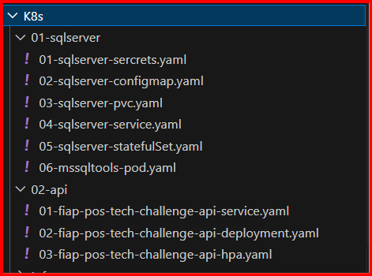

# FIAP-Pos-Tech-Challenge-Revenda-de-Veiculos
TRABALHO SUB TECH CHALLENGE CURSO SOAT – PÓSTECH   FASE 2

Uma empresa de revenda de veículos automotores nos contratou pois quer implantar uma 
plataforma que funcione na internet, sendo assim, temos que criar a plataforma. O time de UX já 
está criando os designs, e ficou sob sua responsabilidade criar a API. O desenho da solução 
envolve as seguintes necessidades do negócio:  

- Cadastrar um veículo para venda (Marca, modelo, ano, cor, preço);  
- Editar os dados do veículo;  
- Efetuar a venda de um veículo (CPF da pessoa que comprou, data da venda);  
- Listagem de veículos à venda, ordenada por preço, do mais barato para o mais caro;  
- Listagem de veículos vendidos, ordenada por preço, do mais barato para o mais caro;  
- Disponibilizar um endpoint (webhook) para que a entidade que processa o pagamento consiga, a partir do código do pagamento, informar se o pagamento foi efetuado ou cancelado.  

Importante: nem todos os campos e funcionalidades necessárias para atender os 
requisitos estão descritos acima, por isso a modelagem é fundamental para entender como 
resolver o problema e entender o que precisa ser feito para que a solução funcione. 

Outro ponto importante é fazer a documentação dos endpoints de forma adequada para que o time de frontend possa fazer a integração de forma correta. O padrão a ser usado é o OpenAPI/Swagger. 
Além disso, como estamos com um novo time responsável pela infraestrutura, será necessário a implantação de Kubernetes. Foi solicitado que toda a descrição dos serviços a serem publicados sejam feitas neste padrão, usando deployment, configmap, secrets e services.
        - 
# Entregáveis 
## 1. PDF contendo os links de acesso aos itens abaixo:  
### 1.1 Repositório com o código-fonte do software;  
- [Repositório :: FIAP-Pos-Tech-Challenge-Revenda-de-Veiculos](https://github.com/fdelima/FIAP-Pos-Tech-Challenge-Revenda-de-Veiculos)  

### 1.2 Vídeo demonstrando a solução funcionando, tanto na implementação da aplicação quanto na infraestrutura Kubernetes.  
- xxx

## 2. Conteúdo do Repositório:  
### 2.1 Arquivo Readme.md que explique o que é o projeto, como foi implementado, como usar localmente e como testar;  
## Como executar no visual studio 2022
* Certifique-se que o docker desktop esteja em execução
* Abra a solução (FIAP-Pos-Tech-Challenge-Revenda-de-Veiculos.sln) com o visual studio 2022
* Com o botão direito sobre o projeto docker-compose selecione Set as Startup Project

* Start visual studio na opção docker-compose conforme imagem abaixo:


## Como executar manualmente no windows
* Certifique-se que o docker desktop esteja em execução
* Após o clone do projeto abra a pasta "Docker" no prompt de comando conforme imagem abaixo:

* Excute o commando abaixo:
```
docker compose up
```
# Navegação
* Documentação     
    * Swagger :: [http://localhost:8080/swagger](http://localhost:8080/swagger/index.html) 
    * API docs by Redocly :: [http://localhost:8080/api-docs](http://localhost:8080/api-docs/index.html) 
### 2.2 Código-fonte de software que funcione corretamente, implemente todas as necessidades acima descritas e implemente os conceitos SOLID e Clean Architecture de forma prescritiva;  

<table>
    <tr>
        <td>
            
        </td>
        <td>
            <h3>Application (Application Business Rules)</h3>
            <p>Esta camada atua como um mediador entre a camada de interface do usuário (Api) e a camada de domínio (Domain).<br/><br/>
            <b>Controllers</b>
            Especificamente, a função dos Controllers é servir como o conector entre as camadas mais externas (que lidam com a interface do usuário ou outras aplicações) e a camada de Casos de Uso. Eles são responsáveis por organizar os passos de uma requisição recebida.
            <br/><br/>
            <b>UseCases</b>
            Os Casos de Uso (Use Cases) residem na camada logo exterior à camada de Entidades e interior à camada de Adaptadores de Interface (onde estão os Controllers, Presenters e Gateways).A principal função dos Casos de Uso é centralizar a implementação das regras de negócio
            </p>                                
        </td>
    </tr>
    <tr>
        <td>
            
        </td>
        <td>
            <h3>Domain (Enterprise Busines Rules)</h3>
            <p> 
                É considerada "O coração do Software", um termo cunhado por Eric Evans (2003).
                Esta camada contém os conceitos de negócios e onde estão todas as regras de negócio.
                É nela que a lógica de negócio é executada.
                <br/><br/>
                <b>Entities</b>
                São a camada mais interna e central da arquitetura. (single-responsibility principle)
                <br/><br/>
                <b>Services</b>
                 A função dos Serviços de Domínio (Domain Services) é a seguinte: • São objetos tratados separadamente. • Trabalham com diversas entidades e agregados. • São utilizados sempre que são necessários cálculos, execuções de rotinas e muito mais. Em resumo, eles atuam como coordenadores ou facilitadores para operações que envolvem múltiplos objetos de domínio (Entidades e Agregados), mas que não se encaixam naturalmente como responsabilidade de uma única Entidade ou Agregado. 
                <br/><br/>
                <b>ValuesObject</b>
                As principais características e funções dos Objetos de Valor, segundo as fontes, são: • São reconhecidos por não possuírem identificadores. • Seus valores são usados para os distinguir um do outro. • Cada Objeto de Valor é único e imutável. O valor é criado como um todo e não muda depois de sua criação
            </p>
        </td>
    </tr>
    <tr>
        <td>
            
        </td>
        <td>
            <h3>Infra (Interface Adapters / Frameworks e Drivers)</h3>
            <p> 
                Camada de Infraestrutura fornece o suporte técnico fundamental, lidando com aspectos como comunicação (mensageria) e armazenamento (persistência de dados), para que as camadas acima (Interface do Usuário, Aplicação e Domínio) possam cumprir suas responsabilidades.
                <br/><br/>
                <b>Gateways</b>
                São componentes que residem na camada de Adaptadores de Interface (ou Interface Adapters). Esta é a camada que faz a intermediação entre as camadas mais internas (Casos de Uso e Entidades) e as camadas mais externas (Frameworks & Drivers)
            </p>
        </td>
    </tr>
    <tr>
        <td>
            
        </td>
        <td>
            <h3>Api (External Interface)</h3>
            <p> 
                 Essa camada é o ponto de interação do usuário (humano ou outro sistema) com o software.
            </p>  
        </td>
    </tr>
    <tr>
        <td>
            
        </td>
        <td>
            <h3>Ioc (Dependency inversion principle)</h3>
            <p> 
                A Inversão de Controle (IoC) é um princípio de design no qual o fluxo de controle de um programa é invertido em comparação com a programação tradicional. Em vez de um objeto controlar a criação e o gerenciamento de suas dependências, essa responsabilidade é delegada a uma entidade externa, como um framework, um container ou outro componente.
                A Injeção de Dependências é um padrão de projeto onde as dependências de um objeto são "injetadas" nele, em vez de ele mesmo criá-las.
            </p> 
        </td>
    </tr>
</table>

### 2.3 Todos os arquivos “manifesto” Kubernetes para a implementação da solução em um cluster, o Dockerfile para o build da aplicação e o arquivo de definição dockercompose que descreva todos os componentes necessários para que a aplicação funcione corretamente e seja possível subir a aplicação localmente usando apenas o comando “docker compose up”.

#### Executando docker-compose localmente no visual studio code
* \Docker  

* Comando
  ```
  docker compose up
  ```
* Resultado esperado


#### Arquivos “manifesto” Kubernetes para a implementação da solução em um cluster.
<table>
    <tr>
        <td>
            
        </td>
        <td>
            <p> <h3>SqlServer</h3>
            <a href="./K8s/01-sqlserver/01-sqlserver-sercrets.yaml">01-sqlserver-sercrets.yaml</a><br/>
            <a href="./K8s/01-sqlserver/02-sqlserver-configmap.yaml">02-sqlserver-configmap.yaml</a><br/>
            <a href="./K8s/01-sqlserver/03-sqlserver-pvc.yaml">03-sqlserver-pvc.yaml</a><br/>
            <a href="./K8s/01-sqlserver/04-sqlserver-service.yaml">04-sqlserver-service.yaml</a><br/>
            <a href="./K8s/01-sqlserver/05-sqlserver-statefulSet.yaml">05-sqlserver-statefulSet.yaml</a><br/>
            <a href="./K8s/01-sqlserver/06-mssqltools-pod.yaml">06-mssqltools-pod.yaml</a>
            </p>
            <p> <h3>Api</h3>
            <a href="./K8s/02-api/01-fiap-pos-tech-challenge-api-service.yaml">01-fiap-pos-tech-challenge-api-service.yaml</a><br/>
            <a href="./K8s/02-api/02-fiap-pos-tech-challenge-api-deployment.yaml">02-fiap-pos-tech-challenge-api-deployment.yaml</a><br/>
            <a href="./K8s/02-api/03-fiap-pos-tech-challenge-api-hpa.yaml">03-fiap-pos-tech-challenge-api-hpa.yaml</a>
        </td>
    </tr>
</table>

#### Executando Kubernets localmente no visual studio code
* \K8s\01-sqlserver  

* Comando
  ```
  kubectl apply -f .
  ```
* Resultado esperado


* \K8s\02-api  

* Comando
  ```
  kubectl apply -f .
  ```
* Resultado esperado


# Extras
## Banco de dados
### Diagrama entidade relacionamento (DER)


 ### Qualidade de software;
 #### **Teste realizados**  
 > Realizado teste de componente em BDD.  
 > Realizado teste de integração.  
 > Realizado teste unitários.  
 > *      
 >    
 > * **Code coverage**  
   
 [Xunit Code Coverage :: Veja aqui mais detalhes](https://html-preview.github.io/?url=https://github.com/fdelima/FIAP-Pos-Tech-Challenge-Revenda-de-Veiculos/blob/develop/TestProject/CodeCoverage/Report/index.html)
  
 ## Branch protegida
 * main  
 
 

 ## CI/CD
- Workflows
    - FIAP Pos Tech Challenge Revenda de Veiculos Api Workflow
        - [Workflow file](/.github/workflows/dotnet.yml)
        - [Action](https://github.com/fdelima/FIAP-Pos-Tech-Challenge-Revenda-de-Veiculos/actions/runs/14987953033/job/42105341829)
    - FIAP Pos Tech Challenge Revenda de Veiculos Mssql Tools Workflow
        - [Workflow file](/.github/workflows/mssql-tools.yml)
        - [Action](https://github.com/fdelima/FIAP-Pos-Tech-Challenge-Revenda-de-Veiculos/actions/runs/14960860467/job/42022537140)    
    - Deploy Terraform K8s In Azure with User-assigned Managed Identity Workfow 
        - [Workflow file](/.github/workflows/deploy-terraform-k8s-infrastructure-in-azure.yml)
        - [Action criando recursos no azure](https://github.com/fdelima/FIAP-Pos-Tech-Challenge-Revenda-de-Veiculos/actions/runs/14995550366/job/42128775003)
    - Deploy APP TO AKS Workflow
        - [Workflow file](/.github/workflows/deploy-azure-kubernetes-service.yml)
        - [Action](https://github.com/fdelima/FIAP-Pos-Tech-Challenge-Revenda-de-Veiculos/actions/runs/15002873630/job/42154102499)
    - Deploy Terraform SqlServer In Azure with User-assigned Managed Identity Workfow
        - [Workflow file](/.github/workflows/deploy-terraform-sqlserver-infrastructure-in-azure.yml)
        - [Action criando recursos no azure](https://github.com/fdelima/FIAP-Pos-Tech-Challenge-Revenda-de-Veiculos/actions/runs/15002391869/job/42152466086)


